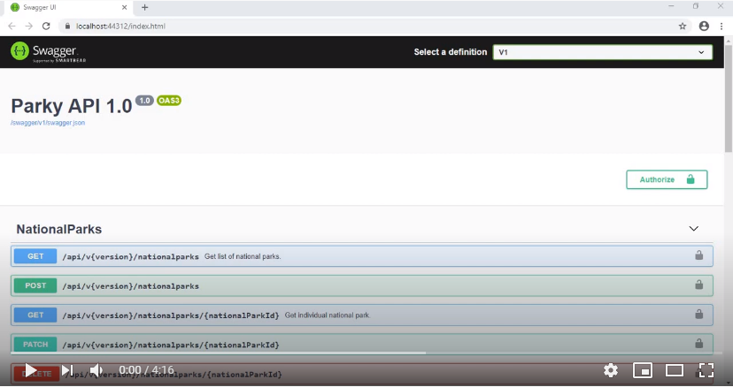
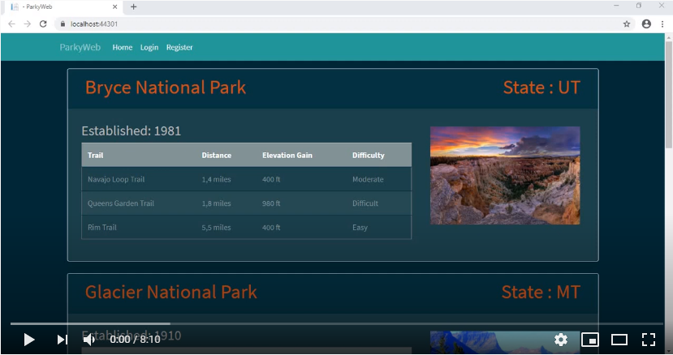

# Parky
ParkyAPI and ParkyWeb - two ASP.NET Core projects used in one web application which is called Parky

This program is written using ASP.NET Core (ASP.NET Core WebAPI and ASP.NET Core MVC).

<h3>To see how this web application works watch two demo videos below.</h3>

<strong>Parky API:</strong>

<strong>Parky Web:</strong>

